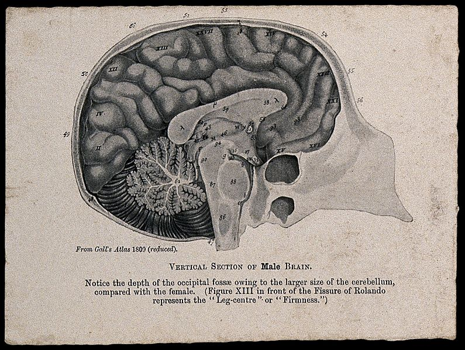

```{r setup, include=FALSE}
usethis::use_git_ignore(c("*.csv", "*.rds"))
options(htmltools.dir.version = FALSE)

library(knitr)
library(tidyverse)
library(xaringan)
library(fontawesome)
```

class: inverse, center, middle

**View the slides:** 

[bretsw.github.io/eme6356-module2](https://bretsw.github.io/eme6356-module2)

---

class: inverse, center, middle

# Welcome to our special guest!

---

# Yulan Lin

```{r, out.width = "540px", echo = FALSE, fig.align = "center"}

```

---

class: inverse, center, middle

# Module 1 Readings

---

class: inverse, center, middle

# Big idea \#1: <br> Predictions based on correlations

---

# Correlation as proxy

```{r, out.width = "600px", echo = FALSE, fig.align = "center"}

```

--

> Correlations let us analyze a phenomenon not by shedding light on its inner working but by identifying a useful proxy for it... With correlations, there is no certainty, only probability.

(Mayer-Schönberger & Cukier, 2013, p. 53)

---

# Digital traces `r fa("arrow-right", fill = "#fff")` analytics

```{r, out.width = "600px", echo = FALSE, fig.align = "center"}
include_graphics("img/mask.jpg")
```

--

>...how Google could "predict" the spread of the winter flu in the United States, not just nationally, but down to specific regions and even states. The company could achieve this by looking at what people were searching for on the Internet. Since Google receives more than three billion search queries every day and saves them all, it had plenty of data to work with.

(Mayer-Schönberger & Cukier, 2013, pp. 1-2)

---

# Digital traces `r fa("arrow-right", fill = "#fff")` analytics

```{r, out.width = "600px", echo = FALSE, fig.align = "center"}
include_graphics("img/mask.jpg")
```

> With it, by the time the next pandemic comes around, the world will have a better tool at its disposal to predict and thus prevent its spread.

(Mayer-Schönberger & Cukier, 2013, p. 3)

---

class: inverse, center, middle

# How well have analytics helped during COVID-19?

---

class: inverse, center, middle

# Compelling question \#1: <br> Why haven't analytics helped more?

---

class: inverse, center, middle

#  Big idea \#2: <br> What, not why

---

# Motivation agnosticism

```{r, out.width = "480px", echo = FALSE, fig.align = "center"}
include_graphics("img/manhole.jpg")
```

--

> Knowing why might be pleasant, but it's unimportant for stimulating sales... Knowing *what*, not *why*, is good enough.

(Mayer-Schönberger & Cukier, 2013, p. 52)

---

# Motivation agnosticism

```{r, out.width = "480px", echo = FALSE, fig.align = "center"}
include_graphics("img/manhole.jpg")
```

> We had to use all the data, as much as we could possibly collect, not just a small portion. We needed to accept messiness rather than treat exactitude as a central priority. And we had to put our trust in correlations without fully knowing the causal basis for the predictions.

(Mayer-Schönberger & Cukier, 2013, p. 70)

---

# End of theory?

```{r, out.width = "480px", echo = FALSE, fig.align = "center"}

```

--

> ...the data deluge makes the scientific method obsolete.

> With enough data, the numbers speak for themselves. Petabytes allow us to say: "Correlation is enough."

(Chris Anderson, 2008, as cited in Mayer-Schönberger & Cukier, 2013, pp. 70-71)

---

class: inverse, center, middle

# Compelling question \#2: <br> Is there a need for theory?

---

class: inverse, center, middle

# Big idea \#3: <br> Data speak for themselves

---

# Justified by the ends

```{r, out.width = "480px", echo = FALSE, fig.align = "center"}
include_graphics("img/relax.jpg")
```

--

> Admittedly, chilling people's freedom to interact with information would be terrible. On the other hand, the benefit is that making insurance easier and less expensive to obtain may result in more insured people, which is a good thing for society, not to mention insurance firms.

(Mayer-Schönberger & Cukier, 2013, p. 58)

---

# Predicting pregnancy

```{r, out.width = "480px", echo = FALSE, fig.align = "center"}

```

--

> "I had a talk with my daughter," he said. "It turns out there's been some activities in my house I haven't been completely aware of. She's due in August. I owe you an apology."

(Charles Duhigg, 2012, as cited in Mayer-Schönberger & Cukier, 2013, pp. 58)

---

# Predicting crime

```{r, out.width = "480px", echo = FALSE, fig.align = "center"}
include_graphics("img/broken-window.jpg")
```

--

> The same technologies will be applied to diagnosing illnesses, recommending treatments, perhaps even identifying "criminals" before one actually commits a crime.

(Mayer-Schönberger & Cukier, 2013, p. 12)

---

class: inverse, center, middle

# Compelling question \#3: <br> Is there a problem with letting data speak for themselves?

---

class: inverse, center, middle

# Compelling questions

---

# Compelling questions

```{r, out.width = "480px", echo = FALSE, fig.align = "center"}
include_graphics("img/question.jpg")
```

--

- Is there a problem with letting data speak for themselves?

--

- Is there a need for theory?

--

- Why haven't analytics helped more?

---

# Reinventing phrenology

--

```{r, out.width = "600px", echo = FALSE, fig.align = "center"}

```

<div class="caption">
<a href="https://commons.wikimedia.org/wiki/File:A_male_brain,_sectioned_vertically._Photomechanical_reproduc_Wellcome_V0009502EL.jpg">See page for author</a>, <a href="https://creativecommons.org/licenses/by/4.0">CC BY 4.0</a>, via Wikimedia Commons
</div>

--

## **Don't do this!**

---

# Compelling questions

```{r, out.width = "480px", echo = FALSE, fig.align = "center"}
include_graphics("img/question.jpg")
```

- Is there a problem with letting data speak for themselves?

- Is there a need for theory?

- Why haven't analytics helped more?

---

class: inverse, center, middle

# Looking ahead

---

# Semester schedule

```{r, out.width = "480px", echo = FALSE, fig.align = "center"}
include_graphics("img/across-time.jpg")
```

- Module 3: Analytics Tools (focus on K-12 and Higher Ed)

- Module 4: Social Media Analytics

- Module 5: Data Visualization

- Module 6: Educational Data Mining and Learning Analytics

- Module 7: Challenges in Learning Analytics

- Module 8: Case Discussions

- Module 9: Future of Analytics

---

# Major Assignments

```{r, out.width = "480px", echo = FALSE, fig.align = "center"}
include_graphics("img/build.jpg")
```

- Flipgrid discussions (8 x 25 points)

- Case discussions (200 points)

- Analytics Practice Activities (3 x 150 points)

- Analytics Problem Plan (150 points)

---

class: inverse, center, middle

# Questions?

```{r, out.width = "480px", echo = FALSE, fig.align = "center"}
include_graphics("img/question.jpg")
```

**What questions can I answer for you now?**

**How can I support you this week?**

<hr>

`r fa("envelope", fill = "white")` [bret.staudtwillet@fsu.edu](mailto:bret.staudtwillet@fsu.edu) | `r fa("twitter", fill = "white")` [@bretsw](https://twitter.com/bretsw) | `r fa("globe", fill = "white")` [bretsw.com](http://bretsw.com)